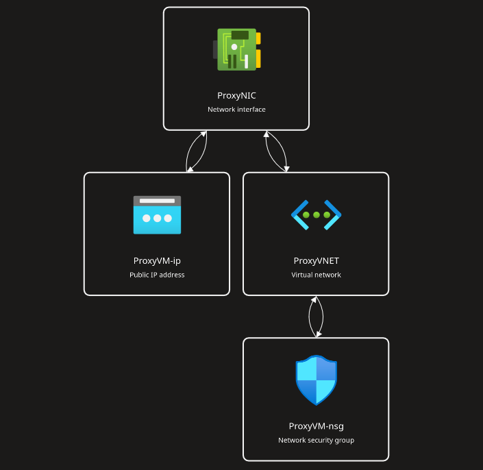

# "Instant" Azure Proxy Server
The following short guide will allow you to create a simple Flatcar Linux VM instance in Azure using my default settings, and the cheapest configuration possible (>$4USD/mo as of 06/23). Flatcar is designed as a container OS, and is perfect for spinning up an instance of Nginx Proxy Manager.

## Step 1
Clone the files from this project and cd into the main directory
```bash
git clone github.com/alecsliger/instaproxy
```
## Step 2
Install Azure CLI
- [Microsoft's Guide](https://learn.microsoft.com/en-us/cli/azure/install-azure-cli)

## Step 3
Via Azure CLI or WebGUI, create the following resources inside a new resource group:
- Virtual Network (Name: ProxyVNET)
- Public IP (Name: ProxyVM-ip)
- Network Security Group (Allow your IP in on port 22)
- Network Interface (Name: ProxyNIC)

Then, associate the resources like so:



## Step 4
Update the following in the config files:

- File paths in 'redeploy.sh' with the current location of both the template file and the parameters file
- Azure Subscription ID, Public SSH key, and preferred Region in the parameters file

## Step 5

Run the script and you are done

```bash
./redeploy.sh
```

# Modifying Settings

You can change various items in the ARM template and still retain the core functionality; Most Notably:

- The Ignition configuration in the 'Custom Data' field
- Region of deployment (Must match resource group location and additional charges might apply)
- Tags (in the main JSON file)
- Admin username for SSH (Might get messy)

## Ignition File

Included with the template files is a folder called 'ignition'. This folder contains a script to convert a Butane.yml file to an ignition.json, and then into base64 for use in the template. 

The default 'custom data' in the ARM template is the converted 'butane.yml' file in the aforementioned folder. This configuration simply adds 2GB of swap space to the OS so it can run on the Azure B1ls comfortably. I highly recommend that you leave this configuration in place, and add to it if needed. 

[The documentation for writing a Butane file for this version of Flatcar linux can be found here](https://coreos.github.io/butane/config-flatcar-v1_0/)

## Regions

Before deploying the project, you may want to change the region that azure deploys to. The resource group you create for this project must be created under your selected region, and the value in the parameter file updated to match. 

[A list of Azure regions and name 'codes' can be found in this article](https://azuretracks.com/2021/04/current-azure-region-names-reference/)

## Tags

To change the tags of your newly created resources, you can simply run a Find for the string 'tags' in the flatcar.json file, and change them to your liking.

## Admin Username

Changing the admin username in the parameters file should create a new user on the machine, and bind the ssh-key you added to said user. Changing this should be as simple as replacing 'core' with your chosen value.

## Adding an rsync service for configuration files

Append the following YAML code to your Butane.yml file, update the 'ExecStart=...' line with your rsync command, regenerate your ignition file with the provided script, and update the 'custom data' field in the parameters.json file:

```yaml
    - name: rsync-npm-db.service
      contents: |
        [Unit]
        Description=Pull NPM DB and compose file(s) from external server

        [Service]
        Type=oneshot
        ExecStart=/usr/bin/rsync --COMMAND GOES HERE--
```

